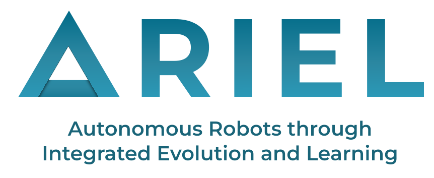

# ARIEL: Autonomous Robots through Integrated Evolution and Learning

<!-- ## Requirements

* [vscode](https://code.visualstudio.com/)
  * [containers ext](https://marketplace.visualstudio.com/items?itemName=ms-vscode-remote.remote-containers)
  * [container tools ext](https://marketplace.visualstudio.com/items?itemName=ms-azuretools.vscode-containers)

* Container manager:
  * [podman desktop](https://podman.io/)
  * [docker desktop](https://www.docker.com/products/docker-desktop/)
  
* [vscode containers tut](https://code.visualstudio.com/docs/devcontainers/tutorial)

--- -->

## Documentation
[ARIEL main documentation page](https://ci-group.github.io/ariel/)

## Quickstart

After [installing](#installation-and-running), build a prebuilt robot, drop it into a world, and launch the MuJoCo viewer:

```python
import mujoco
from mujoco import viewer

from ariel.simulation.environments import SimpleFlatWorld
from ariel.body_phenotypes.robogen_lite.prebuilt_robots.gecko import gecko

# 1. Create a world (a flat terrain)
world = SimpleFlatWorld()

# 2. Build a modular robot body and spawn it into the world
robot = gecko()                       # returns a CoreModule
world.spawn(robot.spec, position=[0, 0, 0.1])

# 3. Compile to a MuJoCo model + data
model = world.spec.compile()
data = mujoco.MjData(model)

# 4. Watch it in the interactive viewer
viewer.launch(model, data)
```

From here, see [`examples/`](examples/) for adding controllers, defining fitness, and running full evolutionary loops.

## Requirements

- **Python** ≥ 3.12
- **MuJoCo** ≥ 3.3.6
- **[uv](https://docs.astral.sh/uv/)** for environment and dependency management

All Python dependencies are declared in [`pyproject.toml`](pyproject.toml) and are installed automatically by `uv sync`.

## Installation and Running

This project uses [uv](https://docs.astral.sh/uv/).

To run the code examples, please do:
1. Clone the repository
```bash
git clone https://github.com/ci-group/ariel.git
cd ariel
```
2. Create a uv virtual environment inside the repository folder
```bash
  uv venv
```
3. Sync the virtual environment with the requirements
```bash
uv sync
```
4. Run an example, in this case, brain evolution (aka learning) using:
```bash
uv run examples/re_book/1_brain_evolution.py
```

## Repository Structure

```
ariel/
├── src/ariel/                      # Main package
│   ├── body_phenotypes/            # Genotype → robot body construction
│   │   ├── robogen_lite/           # RoboGen-lite modular body system
│   │   │   ├── modules/            #   Body parts: core, brick, hinge
│   │   │   ├── decoders/           #   Genotype-to-body decoders (hi-prob, CPPN, vector)
│   │   │   ├── cppn_neat/          #   CPPN/NEAT genome implementation
│   │   │   ├── prebuilt_robots/    #   Ready-made bodies (gecko, spider, ...)
│   │   │   ├── constructor.py      #   Assembles modules into a MuJoCo spec
│   │   │   └── config.py
│   │   └── lynx_mjspec/            # Lynx robot arm body + evolve/replay pipeline
│   ├── ec/                         # Evolutionary computation engine
│   │   ├── genotypes/              #   Encodings: tree, cppn, nde (neural dev. encoding)
│   │   ├── population.py           #   Population container
│   │   ├── individual.py           #   Individual (genotype + fitness + state)
│   │   ├── archive.py              #   Archive of historical individuals
│   │   ├── crossover.py            #   Variation operators
│   │   ├── generators.py           #   Genotype generators + mutators
│   │   └── ea.py                   #   EA orchestration
│   ├── simulation/                 # MuJoCo simulation stack
│   │   ├── environments/           #   Terrains/worlds (flat, rugged, crater, arena, ...)
│   │   ├── tasks/                  #   Tasks (targeted locomotion, gait, turning)
│   │   ├── controllers/            #   Controllers (CPG variants, neural)
│   │   └── mujoco_worker.py        #   Evaluates an individual, returns fitness
│   ├── parameters/                 # Shared types, module defs, MuJoCo params
│   ├── utils/                      # Renderers, trackers, video, optimizers, descriptors
│   └── visualisation/              # Dashboards and analysis tooling
├── examples/                       # Runnable examples
│   ├── a_mujoco/                   #   MuJoCo basics (launcher, rendering, cameras)
│   ├── b_robots/                   #   Building robots from graphs/decoders
│   ├── c_genotypes/                #   Body/brain evolution with genotypes
│   ├── re_book/                    #   "Robot Evolution" book walkthrough examples
│   └── z_ec_course/                #   EC course assignment templates
├── tests/                          # Unit and functional tests
├── docs/                           # Sphinx documentation sources
├── wiki/                           # Project wiki (Obsidian vault)
├── pyproject.toml                  # Project metadata and dependencies (uv)
└── noxfile.py                      # Automation sessions (tests, docs, compiled build)
```

Simulation runs write output to a local `__data__/` directory (created on first run).

## Examples

The [`examples/`](examples/) folder is the best entry point for learning the framework. A good reading order is:

1. [`examples/a_mujoco/`](examples/a_mujoco/): MuJoCo fundamentals: launching a simulation, rendering frames, recording video, and cameras.
2. [`examples/b_robots/`](examples/b_robots/): turning genotypes/graphs into robot bodies and placing them on terrains.
3. [`examples/re_book/`](examples/re_book/): end-to-end brain evolution, then body-brain evolution, learning, and waypoint-following tasks.
4. [`examples/c_genotypes/`](examples/c_genotypes/): body/brain joint evolution, multiprocessing, and replaying results from a database.

## Citation

ARIEL has two official publications, at the ALIFE 2026 conference and at the PPSN 2026 conference.

### ALIFE 2026
```bibtex
@proceedings{10.1162/ISAL.a.962,
    author = {Di Matteo, Jacopo Michele and Grigoriadis, Ioannis and Richárd Ferencz, Áron and Schwarzenbach, Lilly and Eiben, A.E.},
    title = {ARIEL: a Python Framework for Robot Evolution},
    volume = {ALIFE 2026: Proceedings of the 2026 Artificial Life
                    Conference},
    series = {ALIFE 2022: The 2022 Conference on Artificial Life},
    pages = {36},
    year = {2026},
    month = {08},
    abstract = {This paper introduces ARIEL, an open-source Python framework for the development of robots through evolution and learning. ARIEL combines body-brain co-design, persistent database-backed execution, and a global genotype-to-phenotype interface (blueprint). Initially built for a modular mobile robot system, it is easily extensible to other types, including aerial robots and robot manipulators. The framework supports evolutionary development of simulated robots in a design space that allows the construction of ‘physical twins’, enabling a direct connection between the simulated and real world. ARIEL offers standardised tools for experiment setup, analysis, and visualisation. It natively supports asynchronous evolution and learning, allowing selection, reproduction, learning, and evaluation to proceed without global synchronisation. This makes the framework particularly suitable for experiments in which learning and evolution are integrated, evaluation costs vary across individuals, and flexible orchestration of execution is required. A key concept built upon by ARIEL is that of a blueprint, which serves as an intermediate layer between genotype and phenotype. Traditionally, the phenotype is directly derived from the genotype; in our system, the phenotype is derived from the blueprint. This decoupling enables different genotypes to encode morphologies independently of the particular robot system employed.Data/Code available at: https://github.com/ci-group/ariel},
    doi = {10.1162/ISAL.a.962},
    url = {https://doi.org/10.1162/ISAL.a.962},
    eprint = {https://direct.mit.edu/isal/proceedings-pdf/isal2026/38/36/2620468/isal.a.962.pdf},
}
```

### PPSN 2026
```bibtex
@InProceedings{10.1007/978-3-032-36226-1_36,
    author="Grigoriadis, Ioannis and Schwarzenbach, Lilly and Ferencz, {\'A}ron Rich{\'a}rd and di Matteo, Jacopo Michele",
    editor="Iacca, Giovanni and Nadizar, Giorgia and Yaman, Anil and Bucur, Doina and Della Cioppa, Antonio and Hu, Ting and Medvet, Eric and Thomson, Sarah L.",
    title="The Generation Gap: What Using Generations Misses",
    booktitle="Parallel Problem Solving from Nature -- PPSN XIX",
    year="2027",
    publisher="Springer Nature Switzerland",
    address="Cham",
    pages="589--603",
    abstract="Evolutionary computation has produced many successful algorithms and tools. The main challenge in evolutionary computation lies not only in varying and selecting individuals but also in how they are represented, stored, scheduled, and retrieved over time. This paper introduces ARIEL, a framework that shifts evolutionary computation from focusing on generations to persistent, stateful individuals. We present three configurations: (1) synchronous, (2) archive-assisted, and (3) asynchronous. The experiments show that ARIEL's population management can support different evolutionary workflows without changes to the underlying engine or operators. These workflows can all be achieved within the same infrastructure by adjusting eligibility conditions and orchestration logic.",
    isbn="978-3-032-36226-1"
}
```

## Contributing

Contributions are welcome! Please see the [Contributor Guide](CONTRIBUTING.md) and our [Code of Conduct](CODE_OF_CONDUCT.md) before opening an issue or pull request.

## License

Distributed under the terms of the [GPL-3.0 license](LICENSE). ARIEL is free and open source software.
