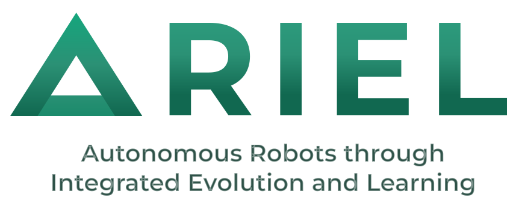

:layout: landing
 
# ARIEL — A Robot Evolution Framework
 

 
**ARIEL** is a Python package that provides efficient and easy-to-use tools for evolutionary computing and evolutionary robotics.
Designed with a clear API, sensible defaults, and support for both beginners and advanced users, ARIEL lets you go from idea to evolving robot with minimal boilerplate.
 
---
 
## Why ARIEL?
 
ARIEL brings together the full evolutionary robotics pipeline in a single, cohesive package:
 
- **End-to-end**: genome encoding → evolution → simulation → result analysis.
- **Batteries included**: pre-built robot bodies, CPG controllers, and EA operators so you spend time on science, not scaffolding.
- **Flexible**: swap genotype representations (NDE, CPPN, Tree, Vector) or optimisers without rewriting your experiment.
- **Scalable**: native support for parallel evaluation via [Ray](source/EA_intro/parallel_ackley).
- **Reproducible**: built-in database logging and pandas/polars/SQLite export for every run.
 
---

## Features

| Feature | Description |
|---|---|
| **Evolutionary Algorithms**                       | Ready-to-use EA operators for both continuous and discrete problems.                          |
| [Multiple Genotype Encodings](source/genoty_docs) | NDE, CPPN, Tree, and Vector representations, each with evolutionary operators.                |
| [Robot Systems](source/robot_systems)             | Modular robot morphology and the ARIEL Lynx Arm, simulated in MuJoCo.                         |
| **Simulation & Control**                          | CPG-based controllers (simple, NA-CPG, normalised) and prebuilt terrains.                     |
| [Parallelisation](source/EA_intro/parallel_ackley)| Scale evaluations across cores or machines with Ray integration.                              |
| [Database & Analysis](source/Db_examples)         | Automatic SQLite experiment logging with pandas, polars, and sqlite3 query examples.          |
| **Visualisation**                                 | GUI (in progress) and analysis utilities for plotting fitness progression and robot behaviour.|
| [MuJoCo Integration](source/Mujoco_docs)          | Full access to MuJoCo data variables — forces, sensors, spatial transforms, and more.         |

---
 
## Installation
 
See the [Installation Guide](source/installation_guide) for full details, including:

- Supported platforms and prerequisites
- Installing with `uv` or VS Code Dev Containers (recommended)
- Verifying your installation
- Troubleshooting tips

---

## Contents

```{toctree}
:maxdepth: 3

Contributing guide <source/contributing_guide/index>
Installation Guide <source/installation_guide>
Robot Systems <source/robot_systems/index>
Genotypes <source/genotype_docs/index>
EAs with ARIEL Introduction <source/EA_intro/index>
GUI <source/GUI>
ARIEL Database Handling <source/Db_examples/index>
MuJoCo Data Variables Documentation <source/Mujoco_docs/mujoco_docs>
```
---

## License

Copyright (c) 2025, ARIEL.  
All rights reserved.

---