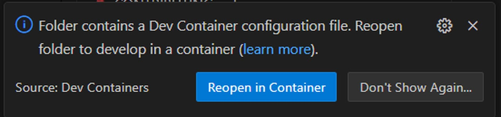

# Installation Guide

This document describes how to install **ARIEL**, a research‑oriented evolutionary robotics and artificial life framework. The guide prioritizes **reproducibility, dependency stability, and ease of use** for both research and teaching environments.

We strongly recommend using either **uv** or **VS Code Dev Containers**. While a pip‑based installation is technically possible, it is discouraged due to frequent dependency conflicts.

---

## Supported Platforms

* Windows 10/11
* macOS
* Linux

---

## Prerequisites

### Required for all installation methods

* Python 3.12+
* Git

### For installation with `uv`

* `uv` package manager. Can be installed using stock Python with `pip`:
```bash 
pip install uv 
```  

### For installation using Dev Containers

* Docker Desktop
* Visual Studio Code
* VS Code *Dev Containers* extension

---

## Choosing an Installation Method

ARIEL depends on a large set of scientific and simulation libraries. Even with pinned versions, dependency conflicts can arise in local Python environments.

* **Dev Containers**
  Provides a fully reproducible, isolated environment. This is the most stable option and is strongly recommended for teaching, collaboration, and long‑term research projects.

* **uv**
  Lightweight and fast, but still relies on the host system. Suitable for users who prefer local environments.

If you encounter installation issues with `uv`, switching to Dev Containers is the recommended solution.

---

## Installation Using `uv`

> This method installs ARIEL directly from the GitHub repository.

### Steps

1. **Clone the repository**

```bash
git clone https://github.com/ci-group/ariel.git
# Enter the cloned folder
cd ariel
```

2. **Create a virtual environment**

```bash
uv venv
```

3. **Install and synchronize dependencies**

The `uv sync` command, installs and/or syncs all dependencies needed for the library to function
```bash
uv sync
```

4. **Run an example**

```bash
uv run examples/re_book/1_brain_evolution.py
```

`uv run` automatically executes the script inside the managed virtual environment; manual activation is not required.

5. **Extending Usability**

If you want to add a dependency to the environment, you can do so using two methods.

1. Add dependency to the environment 
This option adds the dependency to the uv.lock file. This means that it will remain part of your environment until you uninstall it.
```bash
uv add <dependency>
```

2. Install dependency, but don't add it to the environment
This option installs the dependency in your current environment, but does not add it to the uv.lock file. This means that after reloading (re-activating) the environment, the dependency will not be installed.
```bash
uv pip install <dependency>
```

---

## Installation Using VS Code Dev Containers (Recommended)

This method builds a Docker‑based development environment with all dependencies preconfigured.

### Steps

1. Install the **Dev Containers** extension in Visual Studio Code.


2. Open the ARIEL repository folder in VS Code.

3. You should automatically see an pop-up on the bottom right of your screen that asks you to create a dev container for this project. When prompted, select **“Reopen in Container”**.

   * If no prompt appears, open the command palette (`Ctrl+Shift+P` / `Cmd+Shift+P`) and select `Dev Containers: Build and Open in Container`.




4. VS Code will build the container and install all dependencies automatically.

> The initial build may take several minutes depending on your system and internet connection.

Once completed, the environment is ready for use with no additional setup.

---

## Verifying the Installation

To verify that ARIEL is installed correctly, run one of the included examples.

- For `uv`:

```bash
uv run examples/a_mujoco/0_render_single_frame.py
```

- For Dev Containers, run the same command inside the container terminal.

A successful run should execute without import errors and produce either rendered output or logged evolutionary progress, depending on the example.

The output of the `0_render_single_frame.py` should look something like this: 


---

## Troubleshooting

* **Python version errors**: Ensure Python 3.12+ is used. Earlier versions are unsupported.
* **Dependency conflicts (uv)**: Run `uv sync` again or remove the `.venv` directory and recreate the environment.
* **Dev Container build failures**:
  * Verify Docker Desktop is running.
  * Ensure sufficient disk space is available.
* **Unexpected runtime errors**: Try a clean environment or switch to Dev Containers.

For persistent issues, consult the project documentation or repository issue tracker.

---

## Notes on Reproducibility

For published research, coursework, or collaborative projects, **Dev Containers are strongly recommended** to ensure consistent experimental results across systems.

---

## Citation

If you use ARIEL in academic work, please cite the corresponding project publication (citation information will be added soon).
