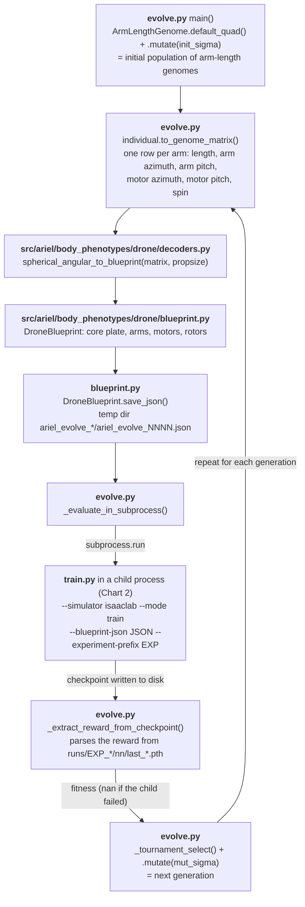
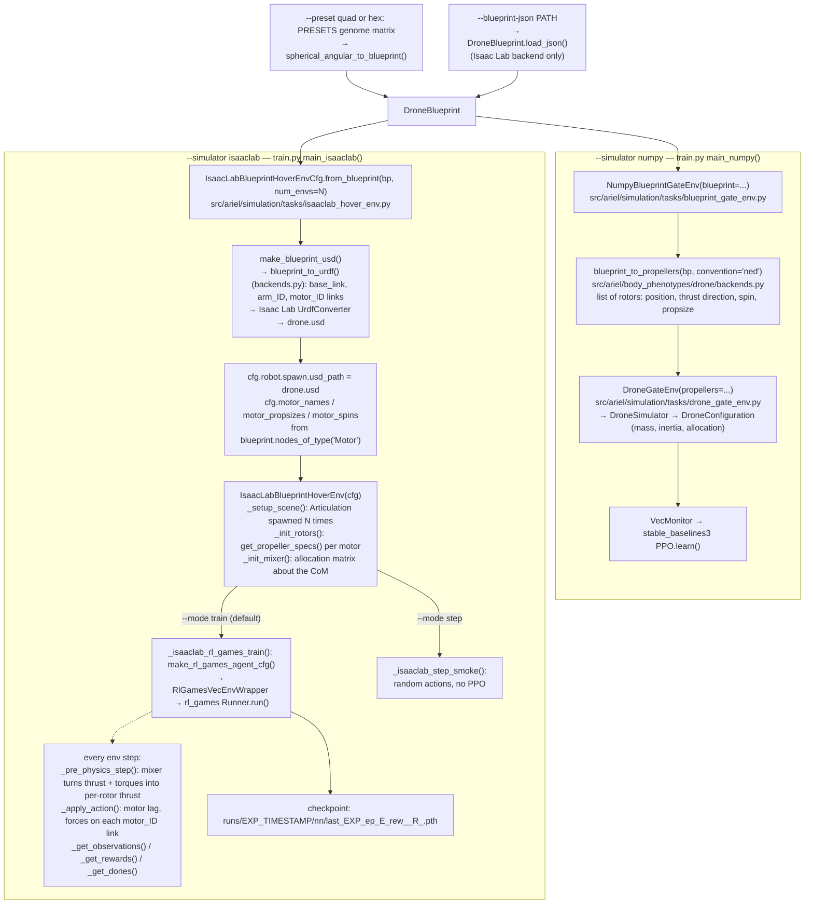

# Pluggable simulator backends for drone evolution + RL

This tutorial demonstrates how ariel decouples the **EA + RL learning loop**
from the **physics simulator** so that collaborators can plug in their
own simulators while reusing ariel's evolutionary and morphology-IR (i.e. Blueprint)
infrastructure.

Two backends ship today:

| `--simulator` | Simulator (physics) | RL library / loop | Task |
|---------------|---------------------|---------------|----------------|
| `numpy` (TUDelft)       | `DroneSimulator` (pure NumPy + SymPy) | **stable-baselines3 PPO** (trains end-to-end) | gate-passing |
| `isaaclab`    | Isaac Lab / Isaac Sim PhysX           | **rl_games PPO** (trains end-to-end; `--mode step` also available for env-construction smokes) | hover-to-goal |

Each backend brings its own simulator **and** its own RL library. The EA loop above never sees the simulator choice; it just gets a fitness scalar back per individual.

**Status:** both backends train end-to-end. The NumPy backend trains
sb3 PPO on the gate-passing task; the Isaac Lab backend trains
`rl_games` PPO on hover-to-goal in a single conda env where ariel's
deps are simulator-agnostic and Isaac Lab owns the binary stack
(torch/gymnasium/numpy) — see §3b for the install recipe. A
reference EA + PPO loop on top of the Isaac Lab backend ships at
[`evolve.py`](./evolve.py); see §6 for how to wire your own RL
pipeline into ariel's EA layer.

---

## 1. The architecture

```
ariel offers: EA loop  +  RL trainers  +  DroneBlueprint IR
─────────────────────────────────────────────────────────────
   genome handlers │ EA operators │ train.py dispatch
                              │
                              ▼
              ─── Plug point: simulator+trainer pair ───
                              │
   ┌─────────────────-────┼──────────────────────────┐
   ▼                          ▼                          ▼
NumpyBlueprintGateEnv   IsaacLabBlueprintHoverEnv   <YourBackendEnv>
 (gymnasium VecEnv)        (DirectRLEnv)             (whatever shape
       +                        +                      your simulator
sb3 PPO                  rl_games PPO                needs)
       │                        │                          │
       ▼                        ▼                          ▼
blueprint_to_propellers   blueprint_to_urdf →       whatever conversion
       │                  UrdfConverter →                  your backend
       ▼                  Isaac Sim spawn                  needs
DroneSimulator
(pure NumPy)
```

**What ariel provides** (above the plug point):
- `DroneBlueprint` — the morphology IR every backend consumes.
- EA operators, genome handlers, repair, inspection, descriptors —
  all simulator-agnostic.
- A unified `train.py` dispatch that routes to backend-specific RL
  glue without exposing the choice to the EA.

**What a simulator backend provides** (below the plug point):
- A learning-ready env constructed from a `DroneBlueprint`.
- Hooks into its preferred RL library (sb3, rsl_rl, rl_games, skrl,
  or anything else).
- A task definition (reward, termination, observation/action spaces).

The EA evolves the same morphology variables either way; 
only the fitness function and the trained policy are backend-specific.

### From genome to trained policy, file by file

Two programs share the work. [`evolve.py`](./evolve.py) owns the
evolution: it turns each genome into a `DroneBlueprint` and asks for a
fitness. [`train.py`](./train.py) owns the learning: it turns one
blueprint into a simulated drone and trains one policy on it. One
`train.py` run always means one fixed morphology; comparing
morphologies is `evolve.py`'s job.

**Chart 1 — evolution to blueprint (`evolve.py`, Isaac Lab backend).**



**Chart 2 — blueprint to RL training (`train.py`).**



**Train your own morphology.** Build a blueprint from any genome matrix,
save it, and hand it to `train.py`. In the matrix, each row is one arm:
length (m), arm azimuth, arm pitch, motor azimuth, motor pitch
(radians), and spin (0 = counter-clockwise, 1 = clockwise). The example
below is a quad with two long and two short arms:

```bash
python - <<'EOF'
import numpy as np
from ariel.body_phenotypes.drone.decoders import spherical_angular_to_blueprint

genome = np.array([
    [0.22, 0.0,           0.0, 0.0, 0.0, 1.0],
    [0.15, np.pi / 2,     0.0, 0.0, 0.0, 0.0],
    [0.22, np.pi,         0.0, 0.0, 0.0, 1.0],
    [0.15, 3 * np.pi / 2, 0.0, 0.0, 0.0, 0.0],
])
spherical_angular_to_blueprint(genome, propsize=5).save_json("my_drone.json")
EOF

python tutorials/pluggable_simulator/train.py --simulator isaaclab --headless \
    --blueprint-json my_drone.json --num-envs 16 --max-iterations 3
```

Run it in the Isaac Lab env (§3b). The NumPy backend has no
`--blueprint-json` flag; it trains only the `--preset` morphologies.

---

## 2. The two contracts

ariel ships two complementary contracts, each matched to its
backend's native shape:

### 2a. `BlueprintGateEnv` Protocol (gymnasium VecEnv)

Lives in
[`src/ariel/simulation/tasks/blueprint_gate_env.py`](../../src/ariel/simulation/tasks/blueprint_gate_env.py).
Used by backends that train with **stable-baselines3** or any other
gymnasium-VecEnv-compatible RL library.

```python
@runtime_checkable
class BlueprintGateEnv(Protocol):
    blueprint: DroneBlueprint
    num_envs: int
    # ...plus the standard VecEnv methods inherited from
    # stable_baselines3.common.vec_env.VecEnv.
```

Conformance: subclass `stable_baselines3.common.vec_env.VecEnv` and
take a `DroneBlueprint` at construction. `NumpyBlueprintGateEnv` is
the shipped reference implementation.

### 2b. Isaac Lab's `DirectRLEnv` shape (lives in `isaaclab.envs`)

Used by backends that train with **Isaac Lab's native RL libraries**
(rsl_rl, rl_games, skrl). Isaac Lab provides this class hierarchy;
our `IsaacLabBlueprintHoverEnv` extends it and slots in a
Blueprint-derived USD at scene-setup time.

```python
class IsaacLabBlueprintHoverEnv(DirectRLEnv):
    cfg: IsaacLabBlueprintHoverEnvCfg
    def __init__(self, cfg, render_mode=None, **kwargs): ...
    def _setup_scene(self): ...
    def _pre_physics_step(self, actions): ...
    def _apply_action(self): ...
    def _get_observations(self): ...
    def _get_rewards(self): ...
    def _get_dones(self): ...
    def _reset_idx(self, env_ids): ...
```

Why two contracts and not one universal? Forcing both simulator
ecosystems through a single shape (e.g., wrapping Isaac Lab to a
gymnasium VecEnv via `isaaclab_rl.sb3`) would mean giving up the RL
libraries each ecosystem is built around. Honest heterogeneity is
cheaper than forced uniformity.

*(Corrected 2026-09-28: this paragraph used to say that
stable-baselines3 collides with the numpy-2 ABI in the Isaac Lab env.
It doesn't: the env built in §3b has numpy 1.26 and
stable-baselines3 2.8 installed together, and both import fine.)*

---

## 3. Environment setup

The two backends need different software, so each gets its own Python
environment. You only need the one(s) you intend to run:

| Backend | Environment | Needs an NVIDIA GPU? |
|---|---|---|
| NumPy (gate task, sb3) | ariel's own `uv` venv (`.venv/`) | No |
| Isaac Lab (hover task, rl_games) | a conda env built around a standalone Isaac Sim (~18 GB) | Yes |

If you are new to the tutorial, start with §3a: it has no GPU or
simulator prerequisites and lets you run §4's NumPy example right away.

Both recipes below were rehearsed end-to-end from fresh clones on
Ubuntu 24.04 on 2026-09-28 (the Isaac Sim download in §3b step 1 was
not repeated; an existing unpack of the same 5.1.0 zip was reused).

### 3a. NumPy backend (gate task, stable-baselines3)

**Prerequisites:** Linux (tested on Ubuntu 24.04), `git` and [`uv`](https://docs.astral.sh/uv/)
(`curl -LsSf https://astral.sh/uv/install.sh | sh`). `uv` downloads a
suitable Python (≥ 3.11) by itself.

```bash
# 1) Get the code. The tutorial lives on the `pluggable-simulator` branch.
git clone -b pluggable-simulator https://github.com/itokeiic/ariel.git
cd ariel

# 2) Create .venv/ with ariel + the RL extras (stable-baselines3, gymnasium, torch).
uv sync --extra rl-sb3 --extra torch

# 3) Activate it. Do this in every new terminal before running the tutorial.
source .venv/bin/activate

# 4) Smoke test: a short PPO run on the NumPy simulator (a few seconds).
python tutorials/pluggable_simulator/train.py --simulator numpy \
    --num-envs 8 --total-timesteps 5000
```

Success looks like `=== training complete ===` followed by the wall
time. See the [project root README](../../README.md) for ariel's other
install options.

### 3b. Isaac Lab backend (hover task, rl_games)

Isaac Lab and Isaac Sim own their binary stack (torch, gymnasium,
numpy), so ariel is installed **into** Isaac Lab's conda env, never the
other way round.

#### Prerequisites

| Requirement | Detail |
|---|---|
| OS | Linux x86_64, Ubuntu 22.04 or 24.04 (NVIDIA's supported list for Isaac Sim 5.1.0) |
| GPU | NVIDIA RTX GPU (needs RT cores — A100/H100 are **not** supported), driver ≥ 580.65.06. Check with `nvidia-smi`. |
| Memory | NVIDIA's stated minimum is 32 GB RAM and 16 GB VRAM. The tutorial's small runs (16 parallel envs) also worked on an 8 GB-VRAM laptop GPU. |
| Disk | ~18 GB for Isaac Sim, ~8 GB for the conda env, ~1 GB for Isaac Lab |
| Tools | `git`, [Miniconda](https://docs.anaconda.com/miniconda/) with `conda init` run once, and `cmake` + `build-essential` (`sudo apt install cmake build-essential`) |

Versions this recipe is tested with: **Isaac Sim 5.1.0** (standalone
build) and **Isaac Lab commit `f4aa17f87e2`** (v2.3.2 + 13). Newer
versions may work but are untested; pin these if in doubt.

#### Step 1 — Install Isaac Sim 5.1.0

Download the standalone Linux build (~18 GB unpacked) and unzip it to
`~/isaacsim`, following NVIDIA's
[workstation install guide](https://docs.isaacsim.omniverse.nvidia.com/5.1.0/installation/install_workstation.html):

```bash
mkdir -p ~/isaacsim
cd ~/Downloads
wget https://downloads.isaacsim.nvidia.com/isaac-sim-standalone-5.1.0-linux-x86_64.zip
unzip isaac-sim-standalone-5.1.0-linux-x86_64.zip -d ~/isaacsim
cd ~/isaacsim
./post_install.sh
```

Optional: `./isaac-sim.compatibility_check.sh` opens a small app that
checks your driver and GPU against Isaac Sim's requirements.

#### Step 2 — Set the paths used below

Adjust these if you put things elsewhere. Every later step uses them,
so run all the steps in the **same terminal**.

```bash
export ISAACSIM_ROOT="$HOME/isaacsim"     # where you unzipped Isaac Sim
export ISAACLAB_ROOT="$HOME/IsaacLab"     # where Isaac Lab will be cloned
export ARIEL_ROOT="$HOME/ariel"           # where ariel will be cloned
export ENV_NAME="ariel-isaaclab-train"    # name of the conda env to create
```

#### Step 3 — Clone Isaac Lab at the tested commit and link Isaac Sim

```bash
git clone https://github.com/isaac-sim/IsaacLab.git "$ISAACLAB_ROOT"
cd "$ISAACLAB_ROOT"
git checkout f4aa17f87e2
ln -s "$ISAACSIM_ROOT" _isaac_sim
```

The `_isaac_sim` link is how Isaac Lab finds a standalone Isaac Sim.
Create it **before** step 4.

#### Step 4 — Create the conda env and install Isaac Lab

```bash
cd "$ISAACLAB_ROOT"
./isaaclab.sh --conda "$ENV_NAME"     # creates a Python 3.11 env
conda activate "$ENV_NAME"
./isaaclab.sh --install               # Isaac Lab + torch 2.7 (cu128) + RL libraries
```

Use `./isaaclab.sh --conda`, not a plain `conda env create`: besides
creating the env, it installs an activation hook that puts Isaac Sim on
the Python path every time you run `conda activate "$ENV_NAME"`.
Without the hook you get `ModuleNotFoundError: No module named
'isaacsim'` (or `'pxr'`) in every new terminal.

`--install` pulls in all of Isaac Lab's RL libraries (rl_games,
rsl_rl, skrl, stable-baselines3). It takes a few minutes with a warm
pip cache and longer on a first download. It may ask for `sudo` if
`cmake` is missing.

#### Step 5 — Install ariel into the env without touching its binaries

`pip install -e . --no-deps` is the key line: it installs ariel without
letting pip replace the torch / gymnasium / numpy that Isaac Lab just
installed. The snapshot-and-diff around it proves nothing moved.

```bash
git clone -b pluggable-simulator https://github.com/itokeiic/ariel.git "$ARIEL_ROOT"
cd "$ARIEL_ROOT"

# Snapshot the simulator-owned binaries.
SNAP="$(mktemp -d)"
pip list --format=freeze | grep -iE "^(torch|torchvision|gymnasium|numpy)==" \
    | sort > "$SNAP/before.txt"

# Install ariel itself, with no dependency resolution.
pip install -e . --no-deps

# Install ariel's pure-Python dependencies. The snapshot doubles as a
# constraints file, so pip cannot upgrade torch/gymnasium/numpy here.
# evotorch and mujoco-mjx are skipped on purpose: they drag in their own
# torch / jax / numpy and are not needed by this tutorial.
pip install --constraint "$SNAP/before.txt" \
    "networkx>=3.2.1" "rich>=14.1.0" \
    "pydantic>=2.11.9" "pydantic-settings>=2.10.1" \
    "sqlalchemy>=2.0.43" "sqlmodel>=0.0.25" \
    "numpy-quaternion>=2023.0.3" "matplotlib>=3.9.4" "mujoco>=3.3.6"

# Guardrail: expect "BINARIES UNCHANGED" and an empty diff.
pip list --format=freeze | grep -iE "^(torch|torchvision|gymnasium|numpy)==" \
    | sort > "$SNAP/after.txt"
diff -u "$SNAP/before.txt" "$SNAP/after.txt" \
    && echo "BINARIES UNCHANGED" \
    || echo "WARNING: simulator binaries changed; see pyproject.toml [project.dependencies]"
```

If you see the warning, the env is suspect: delete it
(`conda env remove -n "$ENV_NAME"`) and start again from step 4.

#### Step 6 — Verify, from a fresh terminal

Open a **new** terminal. This checks that `conda activate` alone is
enough, which is how you will use the env from now on.

```bash
conda activate ariel-isaaclab-train
cd ~/ariel

# Imports: both the Isaac Lab chain and the NumPy chain.
python -c "
from ariel.body_phenotypes.drone.backends import blueprint_to_urdf
from ariel.simulation.tasks.blueprint_gate_env import NumpyBlueprintGateEnv
print('ariel imports OK')
"

# Launch Isaac Sim headless, build the Blueprint drone, step it randomly.
python tutorials/pluggable_simulator/train.py --simulator isaaclab \
    --mode step --headless --num-envs 16 --max-iterations 3
```

Success is `=== env-stepping smoke complete ===` then `exiting (code 0)`.
On a warm machine this takes about 10 s. The very first launch on a new
machine is slower while Isaac Sim fills its caches. You are now ready
for §4.

#### Troubleshooting

- **`No module named 'isaacsim'` / `'pxr'` / `'omni'`** — the activation
  hook is missing (the env was not created with `./isaaclab.sh --conda`, or
  the `_isaac_sim` link did not exist at the time). Re-run
  `./isaaclab.sh --conda "$ENV_NAME"` from `$ISAACLAB_ROOT`; for an
  existing env it just rewrites the hook. Then `conda deactivate` and
  `conda activate` again.
- **`conda activate` fails in a script or cron job** ("Run 'conda init'
  before 'conda activate'") — non-interactive shells do not load conda.
  Add `source "$(conda info --base)/etc/profile.d/conda.sh"` before
  `conda activate`.
- **Wrong Python** — `which python` must point into
  `.../envs/ariel-isaaclab-train/bin/`. If it points at `.venv/` or another
  env, deactivate that first.
- **A run seems to hang, or a core stays busy after a failure** — see §3c.

**Why ariel goes into Isaac Lab's env and not the reverse.** Isaac Sim
5.1 is built against specific binaries (Python 3.11, torch 2.7.0+cu128,
numpy 1.x), and `./isaaclab.sh --install` pins exactly those. ariel's
base `pyproject.toml` keeps `numpy>=1.26,<2` and lists no torch or
gymnasium directly, so it fits inside that env; the one base dependency
that would pull in torch (`evotorch`) is the one step 5 skips. Installing
Isaac Lab into ariel's `uv` venv instead is not supported.

### 3c. Operational gotcha: stale Isaac Sim processes after a failed run

When Isaac Sim errors during launcher init (a config validation problem,
a dependency mismatch, anything before the env-stepping loop starts),
the Python interpreter often doesn't cleanly exit — Isaac Sim's app
threads keep spinning even after the shell prints its prompt. Symptom:
a `python train.py …` process running at ~120% CPU for hours after a
3-iteration smoke test "ended."

After every failed Isaac Sim smoke run, check for orphans:

```bash
ps -u $USER -o pid,etime,pcpu,cmd \
    | grep -E "tutorials/pluggable_simulator/train\.py" \
    | grep -v grep
```

If anything is listed, kill it:

```bash
pkill -KILL -f "tutorials/pluggable_simulator/train.py"
```

This is a known Isaac Sim behavior, not an ariel bug. It also applies
to the official Isaac Lab `train.py` scripts. Worth running the check
after any failed smoke so you don't end up with ~5 cores of CPU
silently burning while you debug.

---

## 4. Running the shipped backends

### NumPy backend (gate task, sb3 PPO)

Run from the ariel repo root with the `.venv` from §3a activated
(`source .venv/bin/activate`). The Isaac Lab env from §3b can run it
too.

```bash
python tutorials/pluggable_simulator/train.py \
    --simulator numpy \
    --preset quad \
    --num-envs 8 \
    --total-timesteps 5000
```

Uses `DroneSimulator` (pure NumPy + SymPy) via `NumpyBlueprintGateEnv`
— a thin shim that calls `blueprint_to_propellers` and forwards to
the established `DroneGateEnv`. Runs on CPU only.

`--total-timesteps` is a minimum, not an exact count: sb3 PPO always
finishes a whole rollout of 2048 steps per env. With 8 envs, a request
for 5000 steps therefore runs 16,384 (2048 × 8), and `train.py` prints
both numbers.

Throughput with 8 envs, measured on an AMD Ryzen 9 PRO 7940HS laptop
(2026-09-28, three runs each; expect different numbers on other CPUs):

| What | Rate |
|---|---|
| PPO training, end to end (`--total-timesteps 50000`) | 3,600–4,000 env-steps/s |
| Simulation stepping alone, random actions | ~25,000 env-steps/s — with `dt` = 0.01 s, about 250 simulated seconds per wall-clock second in total, i.e. ~31× real-time per drone |

### Isaac Lab backend (hover task)

Run from the ariel repo root after `conda activate ariel-isaaclab-train`
(the env you built in §3b). Two modes:

**`--mode train` (default): real `rl_games` PPO training.** This is
the headline workflow — full Blueprint → URDF → USD → Isaac Sim
parallel envs → `rl_games.torch_runner.Runner` PPO. Uses the agent
config from
[`make_rl_games_agent_cfg`](../../src/ariel/simulation/tasks/isaaclab_hover_env.py)
which mirrors Isaac Lab's reference quadcopter PPO config.

```bash
python tutorials/pluggable_simulator/train.py \
    --simulator isaaclab \
    --headless \
    --num-envs 16 \
    --max-iterations 3
```

**`--mode step`: random-action env-stepping smoke.** Skips PPO,
useful for verifying env construction or debugging the Isaac-Lab-
side env-stack without paying for a PPO run. Steps the env with
`uniform(-1, 1)` actions for `max_iterations × 24` steps, computing
observations, rewards and done flags per step.

```bash
python tutorials/pluggable_simulator/train.py \
    --simulator isaaclab \
    --mode step \
    --headless \
    --num-envs 16 \
    --max-iterations 3
```

Both modes share the same `IsaacLabBlueprintHoverEnv`; only the
post-construction code path differs.

#### The hover task

**What the policy controls.** Each step, the policy outputs four numbers:
a collective thrust and roll, pitch and yaw torques. Action 0 means
"hover". With the default `action_mode="mixer"`, a mixer turns these
requests into one thrust per rotor, as a real flight controller does:

- It uses the blueprint's allocation matrix, built from each rotor's
  position relative to the centre of mass, its thrust axis and its spin
  direction.
- It clips each rotor to what its propeller can physically produce.
  For the tutorial's 5-inch propellers that is up to 10.66 N, so a
  0.5 kg quad has a thrust-to-weight ratio of about 8.7.
- Motor speed follows a first-order lag (τ = 0.04 s), with the same
  rotor model as the NumPy backend. Each rotor's thrust and drag torque
  act at its own motor.

So the drone gets what its rotors can deliver. A short-armed drone
cannot produce as much roll torque as a long-armed one, and a request
beyond its reach is clipped. That is how the morphology enters the
control. Two other modes are kept for comparison:

- `"rotor"`: the policy commands each rotor directly. It has the same
  physics, but PPO learned it much less reliably.
- `"wrench"`: Isaac Lab's quadcopter abstraction, in which one force and
  torque are applied to the body and the rotors play no part.

**Reward and termination.** The reward is Isaac Lab's quadcopter reward.
Per step it is `(15·(1 − tanh(d/0.8)) − 0.05·|v|² − 0.01·|ω|²) × step_dt`,
where `d` is the distance to the goal, and `v` and `ω` are the body's
linear and angular velocity. An episode ends after 5 s (250 steps) or
when the drone leaves the 0.1–3 m altitude band. Rewards are
non-negative apart from the small velocity penalties, so staying
airborne always pays.

**Mass differs from the NumPy backend (open item).** This backend takes
mass and inertia from the blueprint's URDF: a 0.4 kg core plate plus
arms and motors. The NumPy backend builds its own mass model, so fitness
is not comparable across the two backends yet.

### EA + RL loop (`evolve.py`, Isaac Lab backend)

[`evolve.py`](./evolve.py) evolves the arm lengths of a quadcopter; for
every candidate it launches `train.py` in a subprocess. The fitness is
rl_games' mean return over the last training episodes, read from the
final checkpoint's filename. Run it from the same env and directory as
above, in one of two sizes:

**Smoke test (the defaults, ~3 min): does the EA ↔ RL pipeline work?**

```bash
python tutorials/pluggable_simulator/evolve.py
```

3 generations × 4 individuals × 30 PPO epochs × 16 envs. Success means
all 12 evaluations finish and every generation prints `failed=0/4`.
30 epochs is too short for PPO to learn to hover, so the fitness values
(−7.2 to −0.6 in our run) are not meaningful. The run took 172 s.

**Hovering check (~8 min): do the trained policies actually hover?**

```bash
python tutorials/pluggable_simulator/evolve.py --epochs-per-eval 200 --num-envs 64
```

Each step's reward is at most 15 × 0.02 = 0.3, and the velocity terms
only subtract. A fitness of F therefore needs episodes averaging at
least F / 0.3 steps. **A fitness ≥ 37.5 proves the drone stayed up for
at least half of the 250-step (5 s) episode.** In our run (2026-09-28,
mixer mode), 8 of 12 individuals passed, with fitness 7.8–51.6. Each
individual took 38–46 s, of which 29–36 s was PPO; the whole run took
498.6 s.

The four that did not pass had not learned to hover within 200 epochs.
Whether PPO learns in time varies between runs, and the EA cannot tell
"failed to learn" from "bad morphology". Read single fitness values
with that in mind.

**What this does not show yet: morphology evolution.** The mixer makes
morphology part of the control, but we have not yet shown that arm
length changes fitness by more than PPO's own randomness. The
hovering check's generation means went 43.7 → 37.3 → 35.0, with no
upward trend. Training fixed arm lengths with three seeds each gave:

| Arm length (all four arms), mixer mode, 200 epochs × 64 envs | Fitness, seeds 42 / 43 / 44 | Mean |
|---|---|---|
| 0.10 m | 49.0 / 3.3 / 51.5 | 34.6 |
| 0.18 m (`evolve.py`'s starting quad) | 45.0 / 48.6 / 53.8 | 49.1 |
| 0.30 m | 25.2 / 40.9 / 43.2 | 36.4 |

The spread between seeds, up to 48.2 when one 0.10 m seed failed to
learn, is larger than the differences between arm lengths. The 0.18 m
quad did best and most consistently, and the 0.30 m quad learned
visibly more slowly. That pattern was noticed only after the runs,
though, and three seeds are too few to confirm it. A check with more
seeds is the next step. For contrast, `"wrench"` mode showed no effect
at all: tripling the arm length moved mean fitness by 1.6, against seed
noise of 8.6–20.0.

---

## 5. Adding your own simulator

Five steps. The exact contract you implement depends on your RL
library of choice:

### If you're using stable-baselines3 (gymnasium VecEnv)

**1. Create `src/ariel/simulation/tasks/<your_backend>_gate_env.py`.**

```python
from stable_baselines3.common.vec_env import VecEnv
from ariel.body_phenotypes.drone.blueprint import DroneBlueprint

class YourBackendBlueprintGateEnv(VecEnv):
    def __init__(self, *, blueprint: DroneBlueprint, num_envs: int, **kwargs):
        # Convert the Blueprint into whatever your simulator needs.
        # Helpers available in ariel.body_phenotypes.drone.backends:
        #   - blueprint_to_propellers(bp)   → list[dict] motor positions/dirs
        #   - blueprint_to_mjspec(bp)       → mujoco.MjSpec
        #   - blueprint_to_urdf(bp, path)   → URDF file
        ...
        self.blueprint = blueprint
        self.num_envs = num_envs
        super().__init__(num_envs=num_envs,
                         observation_space=...,
                         action_space=...)

    # Implement the VecEnv abstract methods:
    def reset(self):       ...
    def step_async(self, actions): ...
    def step_wait(self):   ...
    def close(self):       ...
    def get_attr(self, attr_name, indices=None): ...
    def set_attr(self, attr_name, value, indices=None): ...
    def env_method(self, method_name, *args, indices=None, **kwargs): ...
    def env_is_wrapped(self, wrapper_class, indices=None): ...
```

### If you're using Isaac Lab's native RL (rsl_rl, rl_games, skrl)

**1. Create `src/ariel/simulation/tasks/<your_backend>_<task>_env.py`.**

```python
from isaaclab.envs import DirectRLEnv, DirectRLEnvCfg
from isaaclab.utils import configclass
from ariel.body_phenotypes.drone.blueprint import DroneBlueprint

@configclass
class YourBackendEnvCfg(DirectRLEnvCfg):
    # episode_length_s, decimation, action_space, observation_space, scene, robot ...
    @classmethod
    def from_blueprint(cls, blueprint: DroneBlueprint, **kwargs):
        # Generate a USD asset from the Blueprint, slot path into self.robot.spawn.
        ...

class YourBackendEnv(DirectRLEnv):
    cfg: YourBackendEnvCfg
    def __init__(self, cfg, render_mode=None, **kwargs):
        super().__init__(cfg, render_mode, **kwargs)
        ...
    def _setup_scene(self): ...
    def _pre_physics_step(self, actions): ...
    def _apply_action(self): ...
    def _get_observations(self): ...
    def _get_rewards(self): ...
    def _get_dones(self): ...
    def _reset_idx(self, env_ids): ...
```

### Both paths: register your backend in `train.py`

**2. Add a dispatch branch in `train.py`** (a `main_<your_backend>`
function that imports your env + your RL library and runs training).

**3. Add `--simulator <your_backend>` to the choices list** so the
peek-parser routes correctly.

**4. Verify it runs:**

```bash
python tutorials/pluggable_simulator/train.py --simulator <your_backend> \
    --num-envs 2 --total-timesteps 1000   # or --max-iterations 2
```

**5. Plug into the EA evaluator.** Once training works, point
`ariel.ec.drone.evaluators.gate_evaluator.GateEvaluator` (or your own
evaluator) at the new backend. The EA loop never sees the simulator
choice — it just gets fitness numbers back per individual.

Once your env is in place, see [§6](#6-driving-morphology-evolution-with-your-own-rl-pipeline)
for wiring an EA loop on top — i.e., turning a working trainer into
*morphology evolution + RL*.

---

## 6. Driving morphology evolution with your own RL pipeline

§5 covered the *inner* loop: "I have a simulator and want to train a
policy on a fixed morphology." This section covers the *outer* loop:
"I already have an Isaac Lab + RL training pipeline and want to drive
**morphology evolution** with ariel on top."

Three roles to implement (most partners only write the third):

1. **Genome → DroneBlueprint decoder.** Reuse a shipped decoder
   (`spherical_angular_to_blueprint`, `cartesian_euler_to_blueprint`
   in [`src/ariel/body_phenotypes/drone/decoders.py`](../../src/ariel/body_phenotypes/drone/decoders.py))
   if your genome shape fits — most do.
2. **An RL env that takes a `DroneBlueprint` at construction.**
   Either of the shipped envs is a copy-paste starting point: see
   `IsaacLabBlueprintHoverEnvCfg.from_blueprint` in
   [`src/ariel/simulation/tasks/isaaclab_hover_env.py`](../../src/ariel/simulation/tasks/isaaclab_hover_env.py).
3. **An `evaluate(genome) → fitness` function + outer EA loop.**
   The shipped reference is [`tutorials/pluggable_simulator/evolve.py`](./evolve.py).
   Copy it and replace the inner training call with your trainer.

Five-step recipe (compact, executable):

1. **Pick or write a genome class.** Existing options live in
   [`src/ariel/ec/drone/genome_handlers/`](../../src/ariel/ec/drone/genome_handlers/)
   (`spherical_angular`, `cartesian_euler`, `cppn_neat`,
   `hybrid_cppn`). For the tutorial-sized evolve.py we use an even
   simpler `ArmLengthGenome` defined inline.
2. **Write `genome_to_blueprint(g) → DroneBlueprint`** (or reuse a
   shipped decoder).
3. **Build the env from the blueprint.** Adapt
   `IsaacLabBlueprintHoverEnvCfg.from_blueprint` (or your own env's
   constructor) to take a `DroneBlueprint` and produce a USD on the
   fly via [`blueprint_to_urdf`](../../src/ariel/body_phenotypes/drone/backends.py)
   + Isaac Lab's `UrdfConverter`.
4. **Copy `evolve.py`; replace `_evaluate_in_subprocess` with your
   trainer.** Or — if you prefer in-process — call your trainer
   directly. Note: in-process reuse of `DirectRLEnv` across genomes
   was unreliable in our tests, which is why the shipped reference
   spawns a subprocess per individual.
5. **Plug fitness back.** Three common shapes:
   - parse the rl_games checkpoint filename (simplest, used in
     `evolve.py`);
   - subclass `IsaacAlgoObserver` to capture mean-reward stats inline;
   - run a deterministic post-training eval pass and average reward.

**For deeper material** — file-by-role reference table, in-process
vs subprocess pattern tradeoffs, fitness-extraction options, common
pitfalls — see [`connect_your_pipeline.md`](./connect_your_pipeline.md).

---

## 7. Why this matters

The ARIEL consortium's collaborators bring their own simulators:
MuJoCo, Aerial Gym, Isaac Lab, IsaacGym, custom in-house stacks.
Each group has a preferred RL library too. The two-contract seam
means each can keep their preferred simulator and trainer while
sharing ariel's evolutionary and morphology infrastructure —
decoders, EA operators, repair, descriptors, the morphology IR.
One IR (`DroneBlueprint`), one EA loop, many backends, many
trainers.
